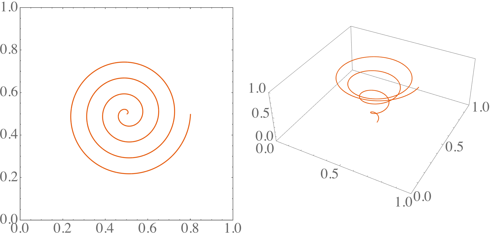
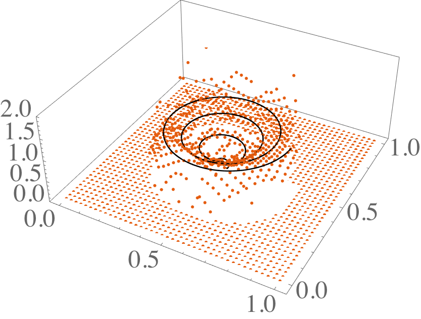
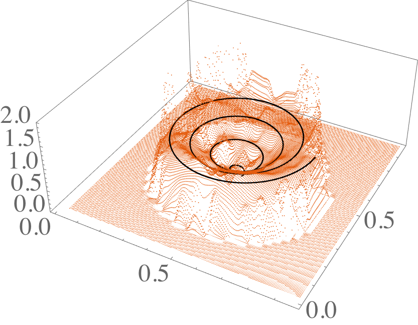
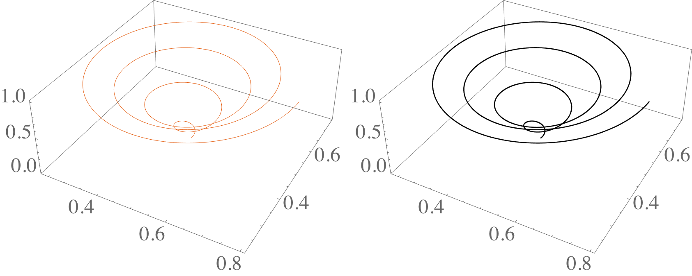

# L2 Project Path to Grid

L2 project a path to a regular grid in arbitrary dimension, using cubic splines in the grid.

## Install

Use the makefile: `make` and `make install`.

## Compilation

Link against the library like this: `g++ -std=c++14 -lL2ProjPathToGrid test.cpp -o test.o`

## Example

See `examples/test` directory.

Generate a path of data:

After running `project()`, the grid obtained is:

Interpolating in this grid at a higher resolution (see Mathematica notebook `analyze`):d

Along the path, the result is identical to the original path:

